# Lab 200: Oracle Digital Assistant integrated with ERP Cloud (INTERNAL ONLY)

<!-- Comment out table of contents
## Table of Contents
[Introduction](#introduction)
-->

## Introduction

This lab walks you through registering a demo using a Fusion Apps demo title that already has an integrated Oracle Digital Assistant demo environment. From there you will be able to interact with the Digital Assistant through the perspective of a Finance Manager and a new hire. 
*In addition to the workshop*, feel free to watch the walk-through companion video by clicking on the following link:
[Lab 200 Walkthrough Video](<INSERT LINK HERE>)

### Objectives
-   Learn how to request a demo instance of ERP Cloud
-   Understand the capabilities of Oracle's pre-built Digital Assistant skill that has been integrated with ERP Cloud.

### Required Artifacts
-   ERP Cloud Instance from [demo.oracle](https://demo.oracle.com/)
-   The estimated time to complete this lab is 30 minutes.

### Extra Resources
-   To learn more about Oracle Digital Assistant (ODA), feel free to explore the capabilities by clicking on this link: [ODA Documentation](https://docs.oracle.com/en/cloud/paas/digital-assistant/)
-   To learn more about , Oracle ERP Cloud feel free to explore the capabilities by clicking on this link: [ERP Cloud](https://go.oracle.com/LP=85331?elqCampaignId=48423&src1=ad:pas:go:dg:erp&src2=wwmk160606p00030c0001&SC=sckw=WWMK160606P00030C0001&mkwid=%7cpmt%7ce%7cpdv%7cc%7c&GOOGLE&oracle+erp+cloud&Cj0KCQjw7qn1BRDqARIsAKMbHDaSJX4r2woRQrLHIFTCk3imWrf6ORbhp3f1czxUvvxVTsz8Votd7TQaAhggEALw_wcB&gclid=Cj0KCQjw7qn1BRDqARIsAKMbHDaSJX4r2woRQrLHIFTCk3imWrf6ORbhp3f1czxUvvxVTsz8Votd7TQaAhggEALw_wcB&gclsrc=aw.ds)

## Part 1. Requesting an ERP Cloud Instance

### **STEP 1**: Login to Demo Central and Request an Environment

-   Once at the [homepage](https://demo.oracle.com/apex/f?p=DEMOWEB:HOME::::::), navigate to the "Demos" section. 

-   Click the **Register a Demo**.

-   Search or select the Demo Title called **FUSION GSI - ERP, SCM, HCM & Engagement Cloud**.

-   Fill in the details, demo resource details, activity dates, and any additional information. 

-   Then select **Next** in the bottom right corner.

-   In the additional information section select the Horizontal or Industry-Specific category that is most applicable. 

-   The next field will ask if you want to add others to this Demo, if applicable please enter the Oracle email of the person you want to add to the demo.

-   Next, select the product you plan to include in your demo. This should be **Products -> Cloud Apps -> Fusion Apps -> ERP Cloud**.

-   Click **Next**.

-   Confirm your details and click **Submit**.

### **STEP 2**: Access ERP Cloud Environment

-   Once the environment has been approved you will receive an email from **demo-central-noreplies_ww@oracle.com**, this will have a **link** where you can access your registration details and environment information. 

-   Make sure to save the access details and copy the password as we will be using it in the next part. Please **Note** that the environment password will change weekly. 

-   Then click on **Launch Demo**

-   Click on **ERP and SCM Cloud Login** and you will be taken to the **Sign In** page for your ERP instance.

-   Here you can sign-in with a few different users using the same password, but in this workshop we will be exploring two different personas. 

## Part 2. Interact with ODA that is integrated with ERP Cloud

### **STEP 1**: Sign-in to ERP Cloud

-   Navigate to the **ERP Cloud** sign-in page like we did in the last step. From here you are going to enter the username **kerry.lane** and the environment password you copied earlier. 

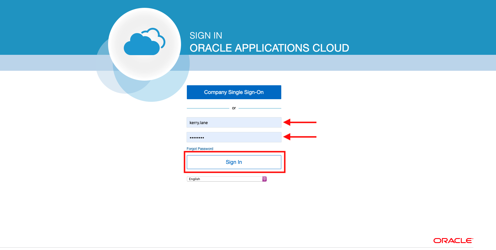

-   Once logged in, you will notice the Digital Assistant icon located at the bottom right hand corner of the page. Click on the **Digital Assistant Icon** and you will notice that the Digital Assistant has initiated the conversation with the Finance Manager. The first thing we are going to showcase is creating an expense report within the Digital Assistant. 

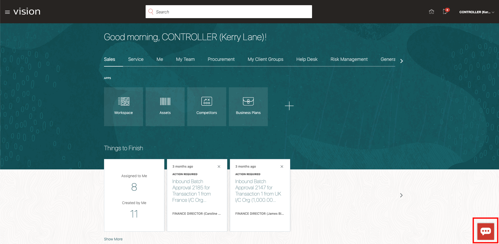

-   In the chat window of the Digital Assistant type in **food expenses $15.46**. You will notice that the Digital Assistant recognizes that he wants to create a new expense and will prompt him to enter a few more details.

-   The Digital Assistant will prompt you to enter:
    - The merchant's name: **Enter your favorite place to eat**
    - The date of the expense: **Enter a date of your choice** (example 3/23/20) 
    - The category of the expense: **Select Breakfast**

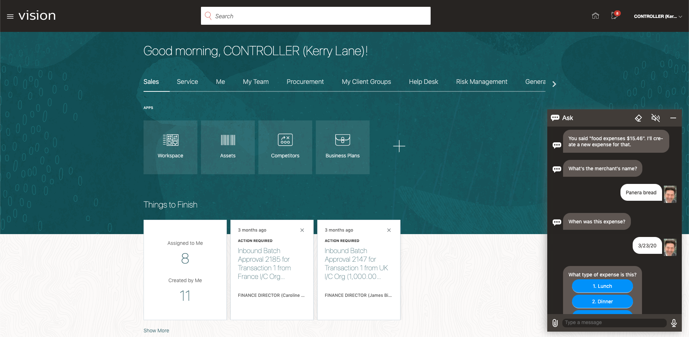

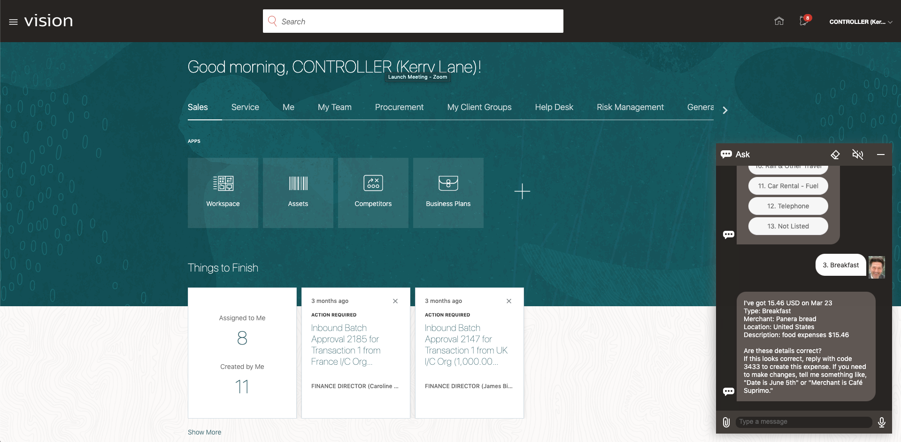

-   Once all the details have been filled in. The Digital Assistant confirms the expense line creation, but we would like to update the description. 

-   To update the description type in **Description is Lunch**

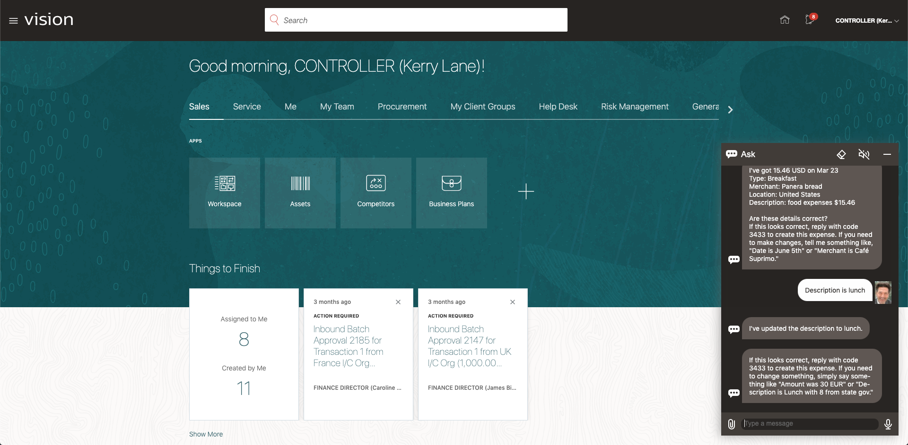

-   Confirm your expense by entering the number given in the Digital Assistant's response. 

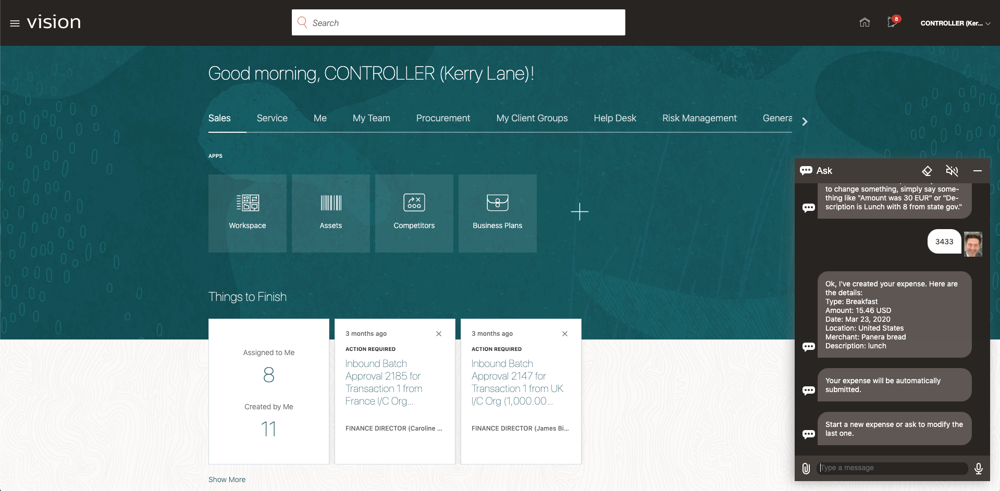

### **STEP 2**: Create an Expense report using a receipt
-   One other way to create an expense report in a Digital Assistant is to upload an image of a receipt. The Digital Assistant uses key words scanned from the image to fill in the expense fields.

-   Download [sample receipt](./files/receipt.jpg)

-   **Upload** the image by selecting the icon to the left of the chat box and navigate to where you downloaded the sample receipt and **upload**. 

-   The Digital Assistant will ask you to enter **the expense type** and select **lunch**

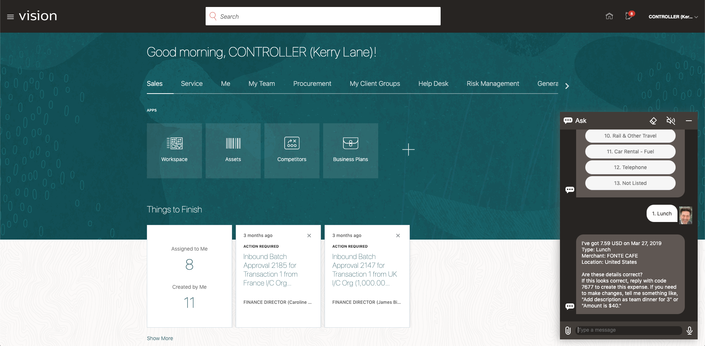

-   The Digital Assistant will give you a summary of the expense and ask you to confirm by entering the **Confirmation Code** in the last message sent by the digital assistant. 

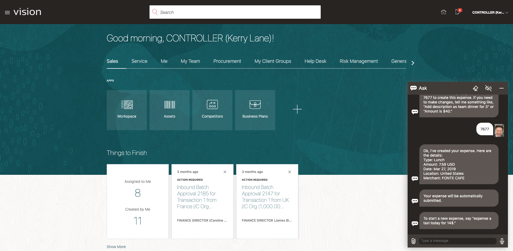

-   To change the date of the last expense submitted, type in **modify the last expense**

-   Type in **Change date to last tuesday**. The Digital Assistant recognizes the correct date through natural language processing, then saves the change, and automatically submits the new expense.  

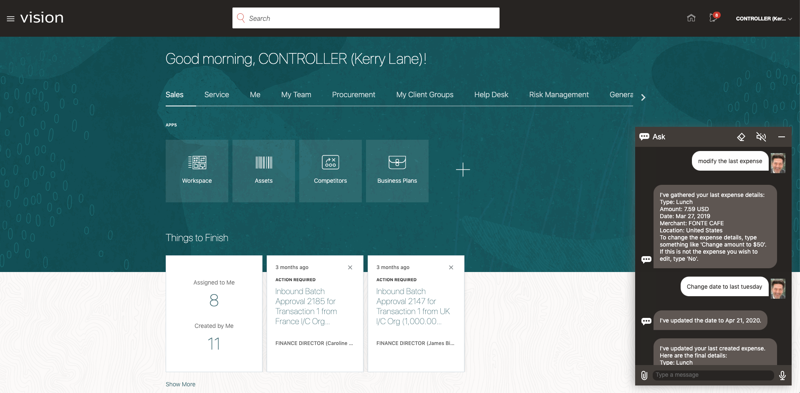

-   Confirm by entering the **confirmation code** in the last message sent from the Digital Assistant. 

-   The Digital Assistant was able to retrieve data from ERP's Finance Module to create, retrieve, and update an expense report.  

## Part 3. Change persona

### **STEP 1**: Sign out kerry.lane

-   Click the top right icon and then click on **Sign Out**

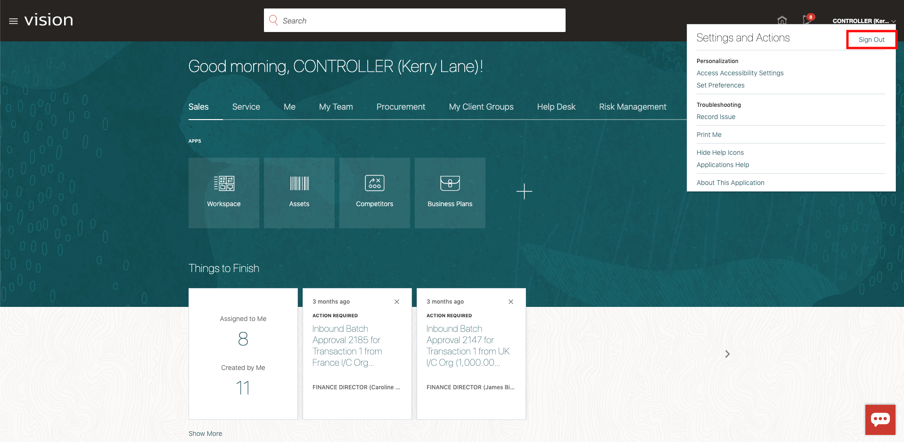

### **STEP 2**: Sign in using brian.joseph

-   Enter the username **brian.joseph** and the **password** you copied earlier in the workshop.

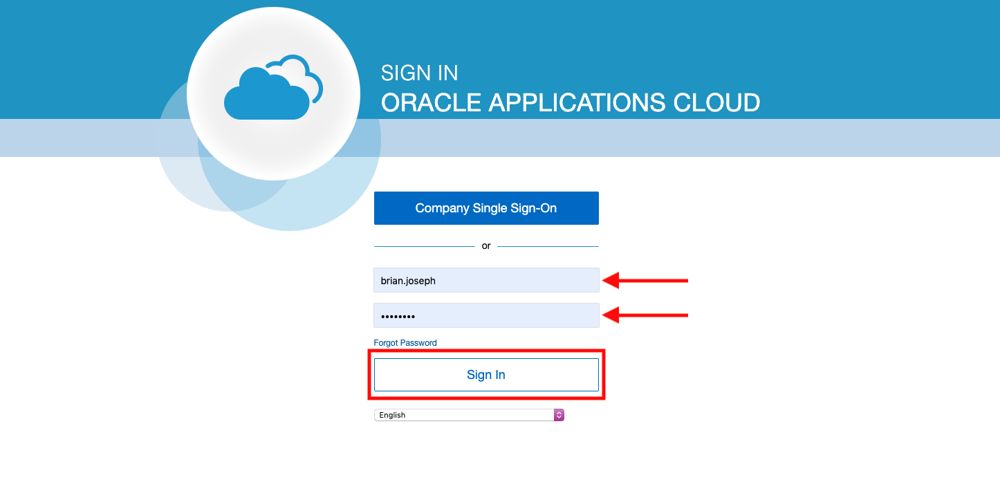

### **STEP 3**: Interact with the Digital Assistant 

-   We are going to switch to the perspective of a new hire. This new hire was told to procure a laptop and business cards through his employer's pre-built Digital Assistant that has been integrated with ERP Cloud Procurement module. **Click** on the **Digital Assistant** icon in the bottom right hand corner and type in **I need a new laptop**

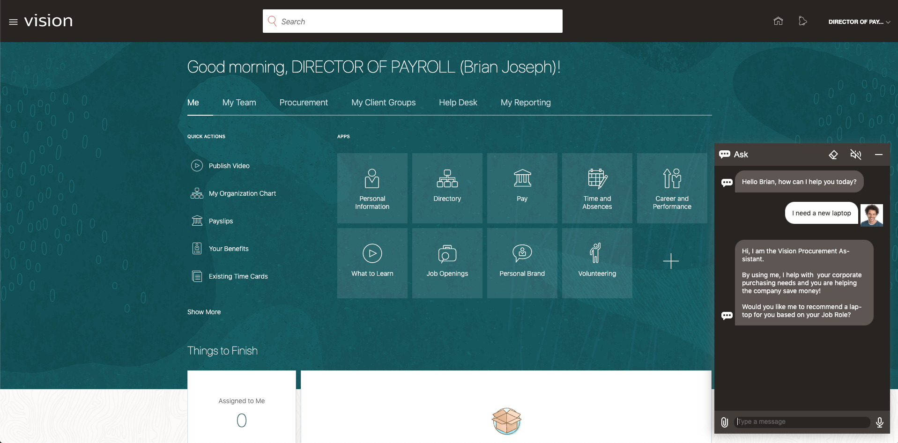

-   The Digital Assistant will prompt you if you would like it to recommend a laptop based on your job role. Type in **Yes**.

-   Browse what is available by clicking on the **Yellow side arrow** and select **more details** on your favorite option.

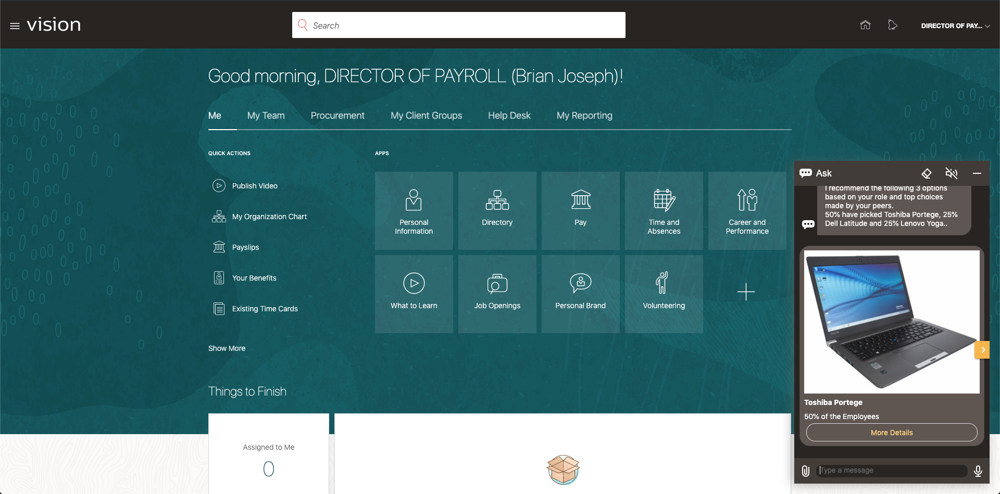

-   The Digital Assistant will provide you with more details and ask if you would like more details on any other laptops.

-   Type in **No**

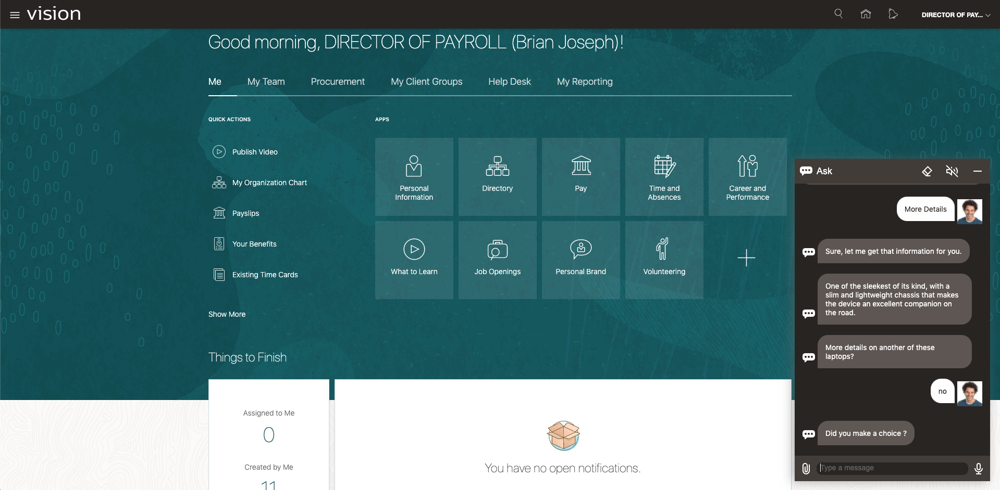

-   The Digital Assistant will ask if you have made a choice. Type in **Yes** and select the **Laptop** you would like to procure.

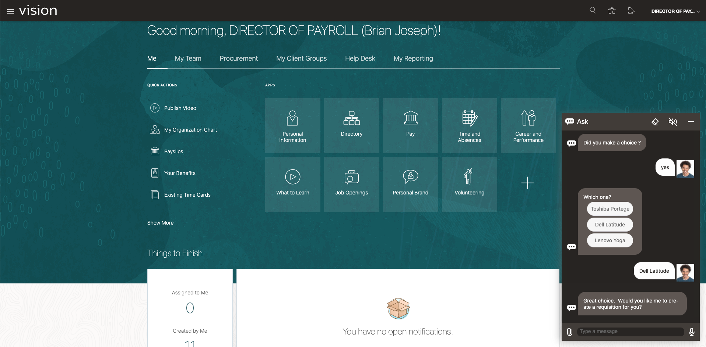

-   Type in **Yes** and the Digital Assistant will create the purchase requisition and route the req. to your manager for approval. 

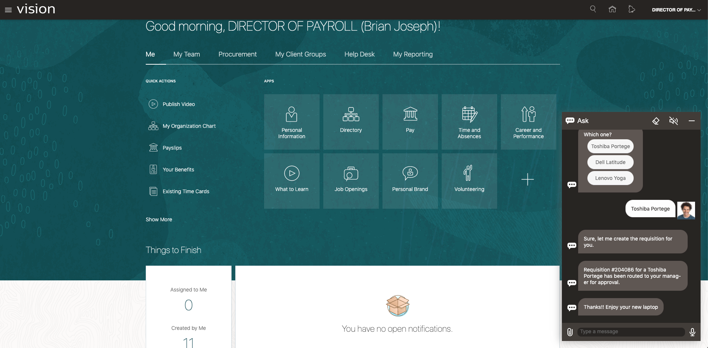

-   The next thing we need to do is procure business cards. To do this type in **Order business cards**

-   The Digital Assistant will respond and give you a preview. 

-   Select **Tap here**

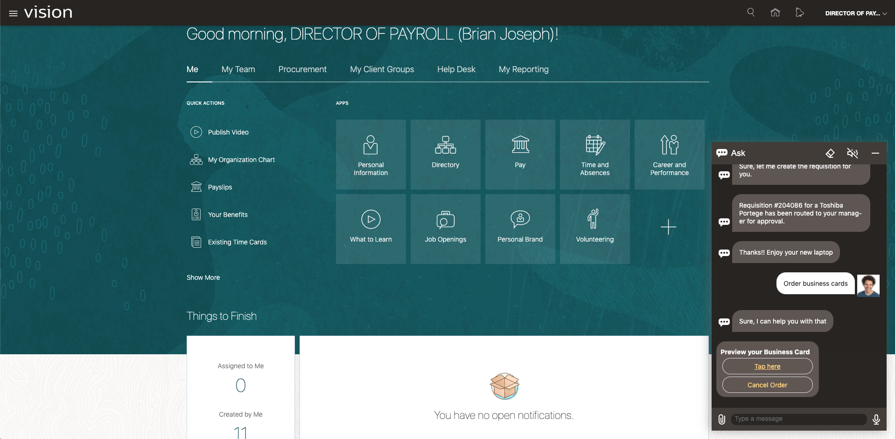

-   This will open up a new tab where you can preview your business cards, select the quantity, and submit the order.

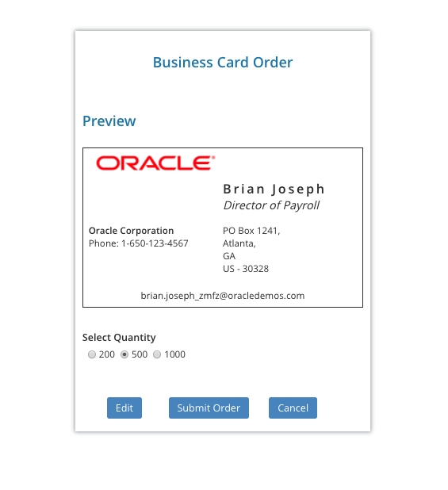

-   Select the quantity you want to order and select submit. **Close** the tab and open up the tab where you are logged into *ERP Cloud**.

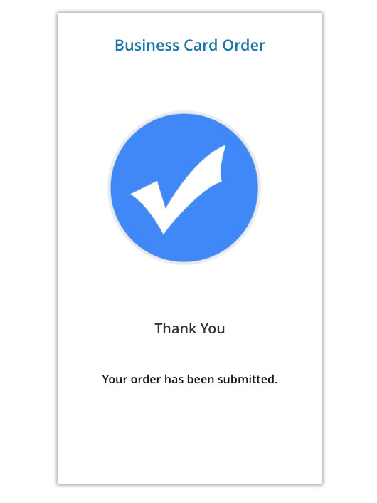

-   The Digital Assistant will create the requisition, display the status of the order, and give you the requisition number.

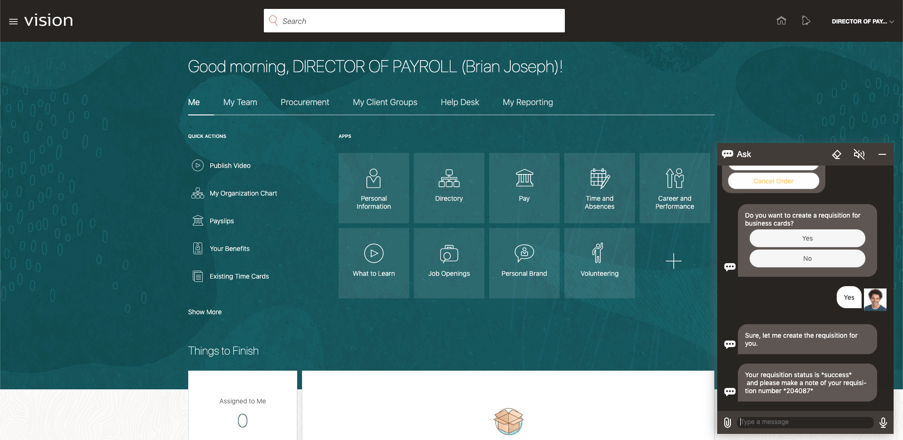

-   When a new tab opened up, the application you were viewing is what's called a **WebView**. A WebView is an application that enables structured data entry through UI element and is able to integrate with the Digital Assistant. The WebView can validate user input and can be built using Oracle Visual Builder Cloud Service, like the one seen earlier, Oracle JET, or React. 

## Part 3. Mobile Application and Oracle's AI Voice

### **STEP 1**: Initial Setup

-   Follow the steps [here](https://demo.oracle.com/apex/f?p=GO:PAGE:0:DSD:NO:1:ID:53992) to install on iOS or Andriod mobile device. 

### **STEP 2**: Interact with ODA

-   In this portion of the workshop we are going to get a few updates on the Finance Manager's account.

-   You can interact with the ODA by typing in the chat box or by clicking the microphone icon in the bottom right.

-   Press the microphone button and say **What is the account balance for cleaning?**

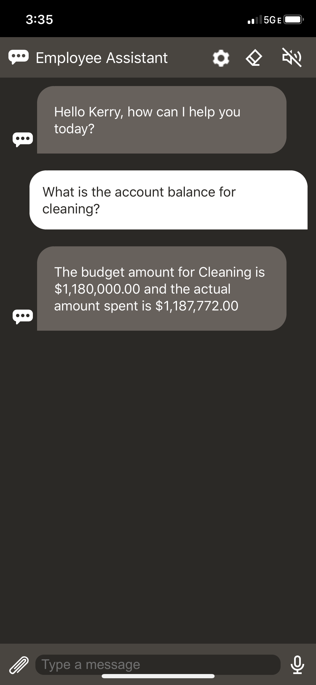

-   Press the microphone button and say **How much do we owe our suppliers office depot?**

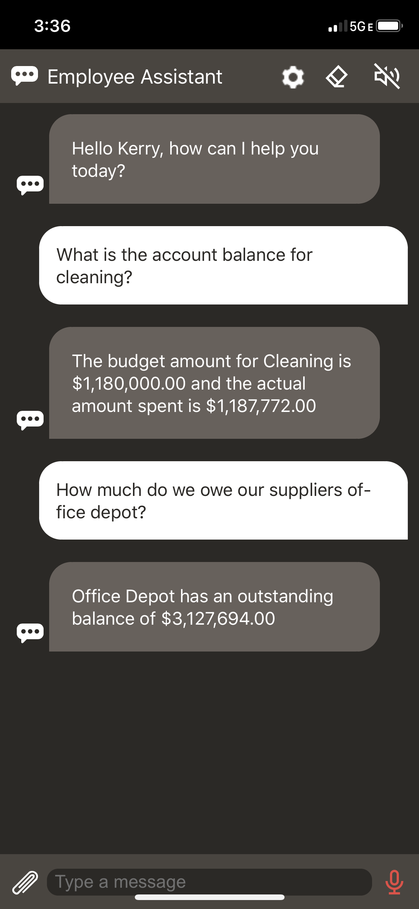

-   Press the microphone button and say **Which account has the largest budget surplus?**

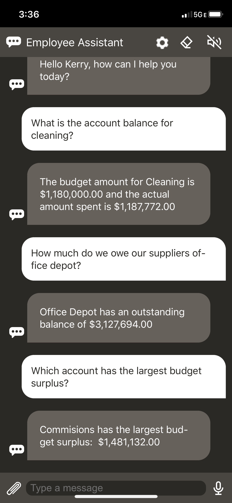

-   Press the microphone button and say **Which project has the highest margins?**

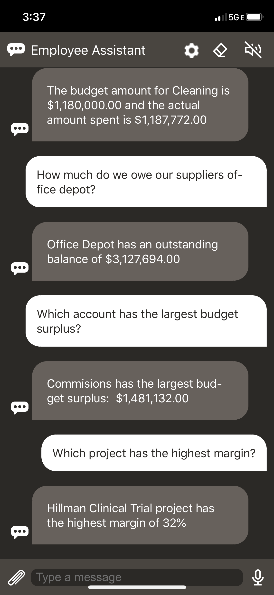

-   Oracle’s Digital assistant provides broad channel support like slack, teams, sms, mobile apps, text-to-speech, and speech to text capabilities. In this portion of the workshop Oracle's AI Voice is being used with no risky exposure to 3rd party api's.

## BONUS: Create a twilio, slack, and/or Facebook channel route to Demo Services ODA

-   [Click here](https://demo.oracle.com/apex/f?p=GO:PAGE:0:DSD:NO:1:ID:76473) to do so.

## Summary

-   In this lab, you requested a demo ERP Cloud instance and interacted with the pre-built Digital Assistant skill for ERP. Oracle Digital Assistant pre-built skills showcase easy, interactive, intuitive and meaningful information without the need to login and open ERP applications.

-   **You are ready to move on to the next lab!**

[Back to top](#introduction)

