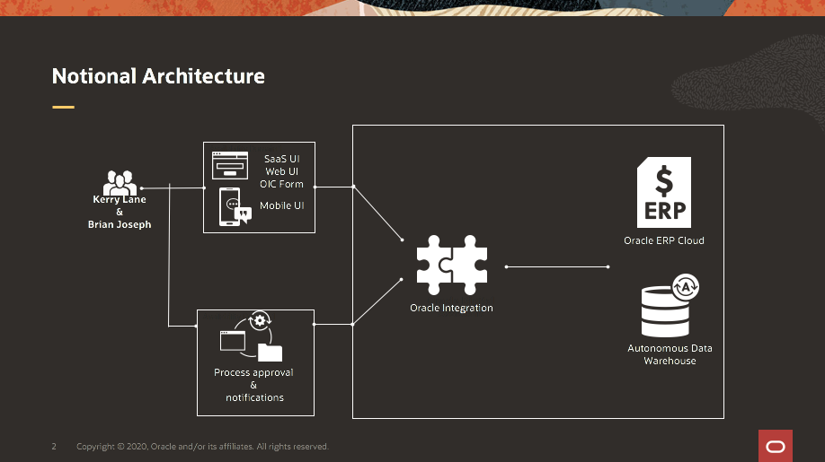
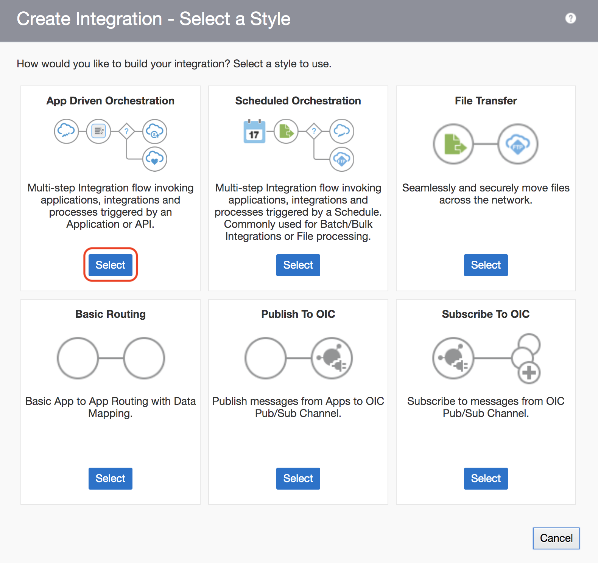

# Lab 300A: Integrating Cloud ERP with OIC (INTERNAL ONLY)
<!-- Comment out table of contents
## Table of Contents
[Introduction](#introduction)
-->


## Introduction

*In addition to the workshop*, feel free to watch the walk-through companion video by clicking on the following link:
[Lab 300A Walkthrough Video](<INSERT LINK HERE>)

In this lab, you will use Oracle Integration to make a connection to your Cloud ERP instance. From there, you will build a basic application integration that creates an Order. After that, you will create a Process that allows for human approval. You will create a process form that allows you to enter order information. The process allows you to define workflow approval and call an integration to create an Order within ERP.



### Objectives
- Make connection to ERP instance
- Build application integration
- Learn process basics
- Create an order
- See end-to-end history of entire process

### Required Artifacts

- Oracle Integration Cloud Instance.
- Oracle ERP Cloud Instance.
- Autonomous Data Warehouse Instance. 
- Postman
- ERP Cloud Instance from 
- Oracle Autonomous Data Warehouse instance with preconfigured Table and access to Wallet file with connection details.
- The estimated time to complete this lab is 90 minutes

### Extra Resources
-   To learn more about Oracle Integration, feel free to explore the capabilities by clicking on this link: [OIC Documentation](https://docs.oracle.com/en/cloud/paas/integration-cloud/index.html)
-   To learn more about , Oracle ERP Cloud feel free to explore the capabilities by clicking on this link: [ERP Cloud](https://go.oracle.com/LP=85331?elqCampaignId=48423&src1=ad:pas:go:dg:erp&src2=wwmk160606p00030c0001&SC=sckw=WWMK160606P00030C0001&mkwid=%7cpmt%7ce%7cpdv%7cc%7c&GOOGLE&oracle+erp+cloud&Cj0KCQjw7qn1BRDqARIsAKMbHDaSJX4r2woRQrLHIFTCk3imWrf6ORbhp3f1czxUvvxVTsz8Votd7TQaAhggEALw_wcB&gclid=Cj0KCQjw7qn1BRDqARIsAKMbHDaSJX4r2woRQrLHIFTCk3imWrf6ORbhp3f1czxUvvxVTsz8Votd7TQaAhggEALw_wcB&gclsrc=aw.ds)

## Part 1. Gather Pre-requisite Information

### **STEP 1**: Obtain Oracle cloud ERP Information

-   Obtain Oracle cloud ERP connection URL. 


-   Usernames to Oracle cloud ERP environments are **bala.gupta** and **ava.clark**.

-   Obtain Password information used to log into your cloud environment.

### **STEP 2**: Obtain Oracle Autonomous Data Warehouse Information

You will need the following to be able to connect to the Oracle Autonomous Data Warehouse : 

-    Wallet file

-    Wallet password

-    Database user and password

-    Database service name

-    Create **table**

## Part 2. Create Connections

### **STEP 1**: Create Connection to Oracle Cloud ERP 

-   Log into Oracle Integration cloud and click on **Integrations** from the menu on the left hand side. 


-   This will take you to the Integrations portion of Oracle Integration from where we can build integrations between Applications. 

-   We will first create connections to all the application we plan on connecting to in our integration. In our case a connection to Oracle Cloud ERP and Oracle Autonomous Data Warehouse. 

-   Now select **Connections** from the menu on the left to take you to the connections page. Once on the **Connections** page click on the **Create button** on the top right corner. 


-   In the search bar type in **ERP** and select **Oracle ERP Cloud**


- Click on the select button. 


-   You will be prompted to enter a name for the connection you are trying to make. Enter **ERP Cloud** in the name section and the Identifier will auto-generate. Leave the role as **Trigger and Invoke**. Click the **Create Button**.

-   Note: When creating a connection the name cannot be the same as any existing connection. If you are in a shared instance please add your initials at the end of the name.


-   We now have to input the credentials for our Oracle ERP Cloud connection. This consists of a connection URL and a security credential. Here the Security credentials are for the user you use to log into ERP Cloud. Please note that the capabilities of the adapter will change according to what roles and responsibility the user has been assigned. For example : If your user doesn't have privileges within the ERP system to view Order Information, you will not be able to use the corresponding APIs with the adapter. 

-   First click on the **Configure Connectivity Button** to enter connection URL. 


-  Enter connection URL for ERP and click the **OK Button** at the bottom. 


-   Click on the **Configure Security Button** to enter security credentials


-   Enter security credentials and click the **OK Button** at the bottom. 


-   Scroll to the top and click on the **Test Button** and then the **Save Button**. 


### **STEP 2**: Create a Connection to Oracle Autonomous Data Warehouse
-   Click on the **Create button** on the top right corner. 


-   Enter **ADW** in the Search bar and select **Oracle ADW**.


-   Select the ADW Option


-   You will be prompted to enter a name for the connection you are trying to make. Enter **ADW ERP** in the name section and the Identifier will auto-generate. Leave the role as **Trigger and Invoke**. Click the **Create Button**.


-   Click on the **Configure Connectivity Button** to enter connection properties.


-   Enter value for the **Service name** field. You can get this from the Wallet in the **tnsnames.ora** file. Then click on the **OK Button**.


-   Click on the **Configure Security Button** to enter security credentials. 


-   Upload your wallet file and enter all the security details. Then click on the **OK Button**.


-   Scroll to the top and click on the **Test Button** and then the **Save Button** 

## Part 3. Create Integration

-   Click on **Integrations** from the menu on the left hand side. Click on the  **Create Button** on the top right corner to create a new Integration. 


-   Select App driven Orchestration. 



-   An Integration Details page will pop up. Enter a **Name** for your Integration. The identifier will auto-generate. The other fields can be left as is. Click the **Create Button** in the bottom.


### **STEP 1**: Add and Configure Rest Adapter

-   You will be taken to a canvas where you can drag and drop the connections that you have configured and map data between applications. It is also possible to create complex logic using the action icons such as for-loops, switch statements, error handling etc. 

-  Click on the **'+' Icon** to add your first adapter. In the search bar type in 'sample' to bring up the **Sample Rest Endpoint** connection. This is a rest adapter configured to be a trigger. Using a Rest trigger will expose the integration that we build as a Rest API. 


-   You will be taken to the page to configure Rest the Rest Endpoint. Enter **Request** for a name and click the **Next Button**


-   Enter **/order** in the relative URI column. Select **POST** from the dropdown as the action you want to perform on the endpoint. Check boxes to **configure a request payload** and **configure to receive response**. Then click the **Next Button**.


-   Select **JSON Sample** from the dropdown in the request payload format.


-   Click on **enter sample JSON inline**.


-   Enter the following Payload in the textbox and click the **OK Button**. This is the structure of the request payload format you want your API to have. 

```JSON
{
  "TransactionIdentifier" : "Creekside Warehouse-14073",
  "BuyingPartyName" : "Pinnacle Technologies",
  "BuyingPartyContactName" : "Isaac Nelson",
  "BusinessUnitName" : "US1 Business Unit",
  "ShipToPartyIdentifier" : "A100000000409220",
  "ShipToPartyName" : "Pinnacle Technologies",
  "BillToCustomerName" : "Pinnacle Technologies",
  "ShipToPartySiteIdentifier" : "A300000048361113",
  "BillToAccountSiteUseIdentifier" : "A300000048361115",
  "OrderItems" : [ {
    "ProductId" : "AS46336",
    "Quantity" : 3
  }, {
    "ProductId" : "AS46336",
    "Quantity" : 3
  } ]
}

```


-   Click the **Next Button**.


-   Select **JSON Sample** from the dropdown in the response payload format.


-   Click on **enter sample JSON inline**.


-   Enter the following Payload in the textbox and click the **OK Button**. This is the structure of the response payload format you want your API to have. 

```JSON
{
  "orderNumber" : "A11231",
  "orderStatus" : "Success"
}
```


-   Click the **Next Button**.


-   Review the Summary and click **Done**.


### **STEP 2**: Add and Configure Cloud ERP Adapter

-   Hover over the grey line  below the Rest Adapter. A **+ Icon** will pop up and then you can click on it.


-   Type in **ERP Cloud** or whatever name you gave your ERP connection and select it.


-   Input a name for the connection, **CreateERPOrder** and click the **Next Button**.


-   Select the first action and click the next button. 


-   Select **Services** from the **Browse By** dropdown.


-   Type in **Order** in the search bar, select **OrderImportService** from the list and then select **createOrders** from the drop down menu. Then click **Next**. 


-   Review the summary and click **Done**.


### **STEP 3**: Add and Configure ADW Adapter

-   Hover over the grey arrow underneath the ERP cloud adapter. Click on the **+ Icon** and enter the ADW connection name. Select the ADW connection. 


-   In the configuration wizard input the name as **DataWarehouse**. From the operations drop down select **Perform an Operation on Table**. 


-   Select **Insert** as the operation and click **Next**.


-   Select **ADMIN** from the schema drop down. Table type can be left as **Table**. From the table list search for the table you want to input data into. In our case it is the **Orders** table. Select **Orders** and click the **single arrow pointing to the left**.


-   Click **Import Tables Button**.


-   Select **TransactionIdentifier** as the primary key. Then click **OK**. This will take you to the previous screen where you can click the **Next Button**.


-   Review Summary and click **Done**.


## Part 4. Map Data

### **STEP 1**: Map to CreateERPOrder

-   Click on **Map to CreateERPOrder** and click on the **pencil icon**.


-   The Mapping canvas will open up. Our goal is to map data elements from the **Source** (column on the left) to the **Target** (column on the right). Expand **request-wrapper** from **Sources** column and **request** from **Target** column.


-   Expand **Order** under **request**.


-   You can map data elements from source to targe by clicking and holding the data element and dragging it over to the data element you want to map it to. Click and hold **TransactionIdentifier** and drag it to **SourceTransactionIdentifier**. Once you are over the Target element let go of your mouse and the elements should be mapped. This is signified by a line between both elements. 

-   Also map **TransactionIdentifier** to **SourceTransactionNumber**


-   Next lets hardcode a value to a target element. Right click on **SourceTransactionSystem** and click on **Create Target Node**. 


-   A box will pop up in the bottom of the screen. Enter **"LEG1"** and click the check box on the right.


-   Now we will finish mapping the rest of the data elements from **Source** to **Target**.
    -   **BuyingPartyName** to **BuyingPartyName**
    -   **BuyingPartyContactName** to **BuyingPartyContactName**
    -   Create target node for **TransactionalCurrencyCode** and input **"USD"**. Click on the check box. 
    -   **BusinessUniteName** to **RequestingBusinessUniteName**
    -   Create target node for **FreezePriceFlag** and input **"false"**. Click on the check box.
    -   Create target node for **FreezeShippingChargeFlag** and input **"false"**. Click on the check box.
    -   Create target node for **FreezeTaxFlag** and input **"false"**. Click on the check box.
    -   **ShipToPartyIdentifier** to **ShipToPartyIdentifier**.
    -   **ShipToPartyName** to **ShipToPartyName**.
    -   **BillToCustomerName** to **BillToCustomerName**.
    -   Create target node for **Line** -> **SourceTransactionLineIdentifier**. Click on the **Toggle functions Icon** on the top right corner. Expand **Node-set**. Select **{}position** and drag it into the expression box in the bottom. Click on the check box.
    
    
    
    
    
    
    
    -   **OrderItems** -> **ProductId** to **Line** -> **ProductNumber**.
    -   **OrderItems** -> **Quantity** to **Line** -> **OrderedQuantity**.
    -   Create target node for **Line** -> **OrderedQuantity** -> **@unityCode** and input **"Ea"**. Click on the check box.
    -   Create target node for **Line** -> **RequestedShipDate**. Click on the **Toggle functions Icon** on the top right corner. Expand **Date**. Select **current-dateTime** and drag it into the expression box in the bottom. Click on the check box.   
    
    
    
    -   Create target node for **Line** -> **PaymentTerms**  and input **"Net 30"**. Click on the check box.
    -   Create target node for **Line** -> **TransactionCategoryCode**  and input **"ORDER"**. Click on the check box.
    -   **ShipToPartyIdentifier** to **Line** -> **ShipToPartyIdentifier**.
    -   **ShipToPartyName** to **Line** -> **ShipToPartyName**.
    -   **BillToCustomerName** to **Line** -> **BillToCustomerName**.
    -   **BillToAccountSiteUseIdentifier** to **Line** -> **BillToAccountSiteUseIdentifier**.
    -   Create target node for **Line** -> **UnitSellingPrice** -> **@currencyCode**  and input **"USD"**. Click on the check box.

-   Click the **Validate Button** on the top right corner and then close.   

### **STEP 2**: Map to Data Warehouse

-   Click on **Map to DataWarehouse**. Select the **pencil Icon**.


-   Map Data elements according to image below.


-   Validate and close mapper.

### **STEP 3**: Map to Data Warehouse

-   Click on **Map to DataWarehouse**. Select the **pencil Icon**.


-   Map Data elements according to image below.


-   Validate and close mapper.

## Part 5. Monitor Integrations

### **STEP 1**: Tracking your Integration

-   Click on the hamburger icon on the top right corner and select **Tracking**. 


-   Drag **TransactionIdentifier** to the **Tracking Field**. All integrations need at least one tracking field assigned before they can be activated. This allows for you to identify your integrations in monitoring and is a useful field to keep track of within running integrations.


-   Click Save


### **STEP 2**:  Enabling your Integration

-   Click the **Switch Button** to activate your integration.


-   Select the check box to **Enable Tracing**. This allows you to see integrations that have run in the **Monitoring** section. 


-   Select the check box to **Include Payload**. This will allow you to see the data being sent to the integration and how it is being processed. 


-   You can access your activated API by clicking the **Gear Icon** against the integration and clicking the **Endpoint URL**.


### **STEP 3**: Testing and Monitoring your Integration

-   You can test your integration using a tool like Postman. Enter your API URL. Select **POST** Action from the drop down. Under the **Authorization** tab, select **Basic Auth** from the **Type** drop down. Enter the **Username & Password** for your OIC environment. 


-   From the **Body** tab select **raw** type and **JSON** from the drop down for your request payload.


-   Enter the following payload to test your API. Then click **Send Button**. 

```JSON
{ "TransactionIdentifier": "Creekside Warehouse-14073", "BuyingPartyName": "Pinnacle Technologies", "BuyingPartyContactName": "Isaac Nelson", "BusinessUnitName": "US1 Business Unit", "ShipToPartyIdentifier": "100000000409220", "ShipToPartyName": "Pinnacle Technologies", "BillToCustomerName": "Pinnacle Technologies", "ShipToPartySiteIdentifier": "300000048361113", "BillToAccountSiteUseIdentifier": "300000048361115", "OrderItems": [ { "ProductId": "AS46336", "Quantity": 3 }, { "ProductId": "AS46336", "Quantity": 3 } ] }
```


-   Verify your response payload and that the Status is a **200 OK**.


-   To view runtime details of our integration lets go to the monitoring section.

-   Click the back arrow at the top left corner. 


-   Select **Monitoring**.


-   Select **Tracking**.


-   Find your integration and click on the Transaction Identifier(Our Tracking field).


-   Notice that your integration path is all green. If there was an error it would be signified with Red at the point of failure. Click on the **hamburger icon** on the top left.


-   Select **Activity Stream**.


-   You can view the payload and data transformations that happen through out your integration. Select any of the **messages** for a more in-depth view. This is a very useful tool when trying to debug integrations. 


## Summary

-   In this lab, you learned how to build an end to end integration with Oracle Cloud ERP and the Autonomous Data Warehouse using the Oracle integration platforms low-code development platform.

-   **You are ready to move on to the next lab!**

[Back to top](#introduction)

