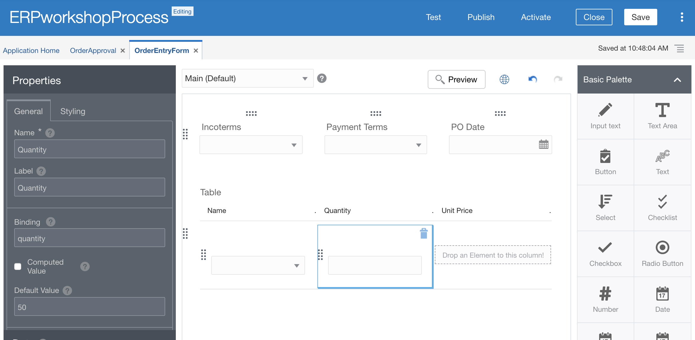
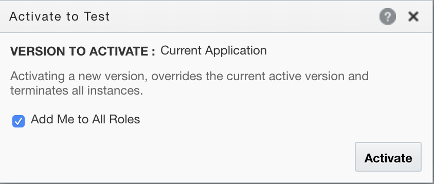
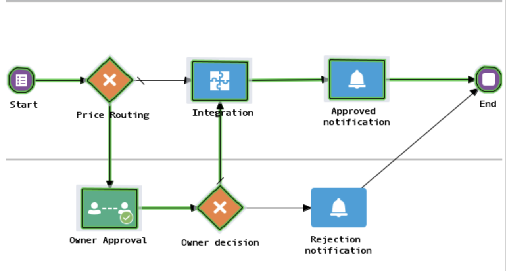

# Lab 300B: Integrating Cloud ERP with OIC (INTERNAL ONLY)

<!-- Comment out table of contents
## Table of Contents
[Introduction](#introduction)
-->

## Introduction
In this lab you will create a Process that allows for human approval. You will create a process form that allows you to enter order information. The process allows you to define workflow approval and call an integration to create an Order within ERP. *In addition to the workshop*, feel free to watch the walk-through companion video by clicking on the following link:
[Lab 300B Walkthrough Video](<INSERT LINK HERE>)

### Objectives
-   Create a process application
-   Test your process application

### Required Artifacts
-   Previously completed lab 300A
-   The estimated time to complete this lab is 90 minutes

### Extra Resources
-   To learn more about Oracle Integration, feel free to explore the capabilities by clicking on this link: [OIC Documentation](https://docs.oracle.com/en/cloud/paas/integration-cloud/index.html)
-   To learn more about , Oracle ERP Cloud feel free to explore the capabilities by clicking on this link: [ERP Cloud](https://go.oracle.com/LP=85331?elqCampaignId=48423&src1=ad:pas:go:dg:erp&src2=wwmk160606p00030c0001&SC=sckw=WWMK160606P00030C0001&mkwid=%7cpmt%7ce%7cpdv%7cc%7c&GOOGLE&oracle+erp+cloud&Cj0KCQjw7qn1BRDqARIsAKMbHDaSJX4r2woRQrLHIFTCk3imWrf6ORbhp3f1czxUvvxVTsz8Votd7TQaAhggEALw_wcB&gclid=Cj0KCQjw7qn1BRDqARIsAKMbHDaSJX4r2woRQrLHIFTCk3imWrf6ORbhp3f1czxUvvxVTsz8Votd7TQaAhggEALw_wcB&gclsrc=aw.ds)

## Part 1. Create a process application

### **STEP 1**: Get started making your process

-   Navigate to the **OIC console** sign-in page provided by your lab facilitator. Enter the provided username & password. **If you do not have the URL or the credentials, please contact your lab facilitator.**

- Click 'Processes' on the left menu

- Now click on 'Process Applications'.

- Click the create button on the top right.

- Click create on the 'Create an Application' box

- Give your process a name and then hit create on the left

- Click the 'create a structured process' on the left, and then start with a form.

- Click form on the right, and enter 'OrderApproval' in the name box. 

- Your prcoess looks like this, click start. 

- Click open properties. 

- This window will appear below.

- Click the plus sign to create a new form.

- Give your form the name 'OrderEntryForm.'

### **STEP 2**: Create your process form

- This is the screen you'll be greet with to create your form, you can see it opened a new tab on the screen. 

- Drag the select from the right to the screen.

- For the properties, scroll down to the options source section, and input these static options.

- Drag another and place it to its right. 

- For payment terms, do the same and input these values.

- Click your select box and give it the following Name & Label. 

- Drag a date action from the right and place it to the right of your Payment select box. 

- Now drag a tab le from the right and place that below your select boxes.

- Click on your table, on the left side of the screen you can see its properties. 

- Enter Name, Quantity, Unit Price for the columns. 

- Drag a select field from the right. 

- Now place it under the Name column.

- Give the select box the following Name, Label, and Binding.

- Scroll down on the properties box and enter these options Names and Options Values.

- Now drag an 'Input Text' action to be underneath the Quantity field. 

- Click the input text box and give it the same Name, Label, and Binding. 

- Now drag a Mondy action from the right and place it under the Unit Price column. 

- Configure the Name, Label, and Binding for the Money box. 

- Mark the unit price 'Read Only' check box.

- Drag another Money field from the right to below your table.

- Configure the same Name, Label, and Binding. 

- Click Total price box and scroll down on the left menu to its binding.

- Configure the computed value to match the above screenshot.

- Now you can press save, and close the 'OrderEntryForm' tab to return to the process designer.

### **STEP 3**: Finish creating your process

- From the right, click the drop down next to gateways, and drag & drop an Exclusive gateway to the right of the start action. 

- Now click the blue box to the left of start, then the pencil icon. 

- Type in customer. 

- Now we have the personas configured for our process, a customer submitting the order, and a process owner to review relevant orders. Now, drag and drop an 'Approve' action from the right, under Human, and place it in the Process Owner section of the screen.

Click the user task and open the properties. 

Click the magnify glass to the right of form. 

Select the OrderEntryForm you previously created. 

Now click the exclusive gateway, and then click the cursor. 

Drag and drop the line from the gateway to the user task. 

Place another exclusive gateway to the right of the user task. 

Drag and drop a cursor from the user task to the new exclusive gateway. 

Under the system action on the right, drag and drop a Notify task to the right of exclusive gateway. 

Open its properties. 

- INSERT 

- Now click the line between Exclusive gateway & User task.

Click the pencil. Then click the pencil to the right of the condition box. 

Enter this logic, you can highlight the totalPrice field, press 'Insert Into Expression' and then add ' > 12000. This will route the integration to need human approval if the total price is over $12,000. We hardcoded a value of $15,000 previously in order to ensure you will need the human approval.

- Your process is coming along well, in the next steps we will add the integration to your process and complete its development.  

### **STEP 4**: Add the integration to the process, Test the Process Application

- Drag and Drop the Integration action to the right of Exclusive Gateway. 

- Click on it and open the properties.

- Click the plus sign and select the integration you previously developed, our's is named 'CreateSalesOrderERP'.

- Your integration should look like this.

- Your screen might be getting crowded, you can drag and drop the 'End' action to the right to have more room.

- Now, drag and drop another Notify action to the right of your integration.

- Configure its properties to have your email in the 'To' box and the same subject & body. 

- Drag and drop a cursor from the new notification task to the End box. 

- Drag and drop the cursor from 'Exclusive gateway 1' to the integration.

- Click the line and then the pencil. Then click the checkbox next to 'Conditional Flow'.

- Click the pencil to the right of the condition box. 

Click 'TaskOutcomeDataObject' then Insert Into Express. Complete the expression by adding '== "REJECT"'.

- Now to clean up our labels, click the exclusive gateway and rename it to 'Price Routing' or the label of your choice.

- Do the same to the second gateway. 

- You can do the same to the notification tasks. 

- Your Process should now resemble this.

- Click the start icon and open the properties. Give it a title. 

- Now click the integration and open its data association.

- Enter these hardcoded values for the respective fields on the right. These hardcoded values will vary for each ERP system, but these are the mandatory fields the API requires to create a new order.

- On the bottom, drag your table data object from the left, and map it to the orderItems table on the right.

- You will see this warning. Press the box in between.

- Change the condition to add.

- Create a new transformation.

- This is what it should look like on your mapper now

- Map the fields from your form table to the fields in the Fusion table like so.

- Your process is complete and should like this now. 

- Click publish, add a comment, then click the publish button.

- After hitting publish, press activate in the blue box, then 'Try in Test Mode' in the green box.

- Press activate, leave the checkbox as is.

- You should see this confirmation

- Press save and test.

### **STEP 5**: Test your Process:

- Click on **Create Order** in **My Apps** section.

- Select **EXW** for Incoterms, **Net 60** for Payment terms, input a PO date. Click on the blue + icon. Add **Vario tablet** as the table name, quantity is **3** and unit price **300**. Click **Submit**

.

- Since the condition to forward the order to the Process owner isn't satisfied the integration will be directly called. You can view Integration status from the monitoring section underneath integration as mentioned in the previous labs.

.

.

.

.

- Test the process again. Enter quantity and net price such that total is over $15,000 and submit. 

.

- Select **My Tasks** from the menu on the right. 

.

- Select your process. 

.

- You can view your process details. Note that when you are reviewing your process you are reviewing it as a proces owner. Once you review your process details you can approve/reject 

.

- Go to **Processes** on the menu.

.

- You can view your end process flow here to see if it was successful.

.

.

## Summary

-   In this lab, you developed an OIC process application that calls the previous integration you built. Together, this gives you an order entry form that performs as if natively part of your ERP Cloud implementation.

-   **You are finished with all of the labs!**

[Back to top](#introduction)

