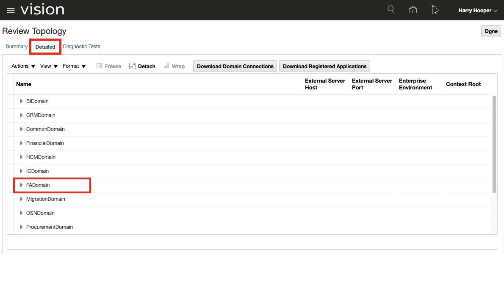
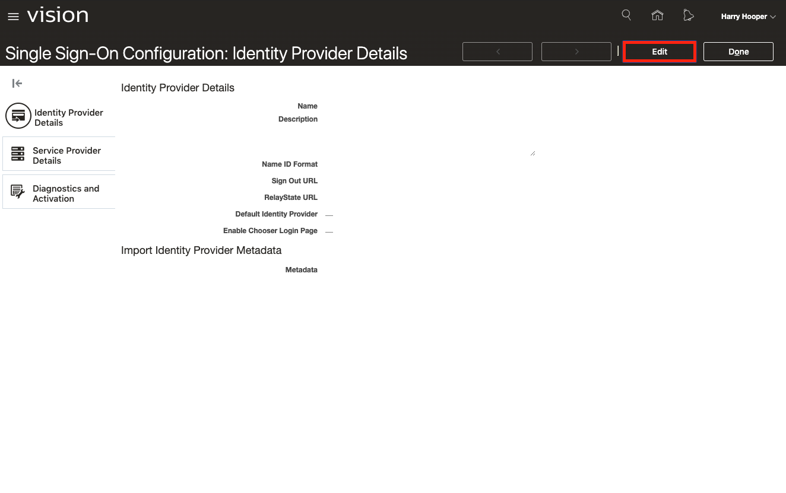

# Lab 400: Securing Oracle ERP with Identity Cloud Service & Cloud Access Security Broker (INTERNAL ONLY)

<!-- Comment out table of contents
## Table of Contents
[Introduction](#introduction)
-->

## Introduction

This lab walks you through registering a Fusion apps demo environment. From there you will be able to start integrating the demo with Identity Cloud Service (IDCS) and Cloud Access Security Broker (CASB). 
*In addition to the workshop*, feel free to watch the walk-through companion video by clicking on the following link:
[Lab 400 Walkthrough Video](<INSERT LINK HERE>)

### Objectives
-   Learn how to request a demo instance of ERP Cloud
-   Understand the capabilities of Oracle's Identity Cloud Service and Cloud Access Security Broker and how they provide an extra layer of security for ERP Cloud.

### Required Artifacts
-   ERP Cloud Instance from [demo.oracle](https://demo.oracle.com/)
-   IDCS Instance
-   CASB Instance
-   The estimated time to complete this lab is 60 minutes.

### Extra Resources
-   To learn more about Identity Cloud Service (IDCS), feel free to explore the capabilities by clicking on this link: [IDCS Documentation](https://docs.oracle.com/en/cloud/paas/identity-cloud/)
-   To learn more about Cloud Access Security Broker (CASB), feel free to explore the capabilities by clicking on this link: [CASB Documentation](https://docs.oracle.com/en/cloud/paas/casb-cloud/)
-   To learn more about , Oracle ERP Cloud feel free to explore the capabilities by clicking on this link: [ERP Cloud](https://go.oracle.com/LP=85331?elqCampaignId=48423&src1=ad:pas:go:dg:erp&src2=wwmk160606p00030c0001&SC=sckw=WWMK160606P00030C0001&mkwid=%7cpmt%7ce%7cpdv%7cc%7c&GOOGLE&oracle+erp+cloud&Cj0KCQjw7qn1BRDqARIsAKMbHDaSJX4r2woRQrLHIFTCk3imWrf6ORbhp3f1czxUvvxVTsz8Votd7TQaAhggEALw_wcB&gclid=Cj0KCQjw7qn1BRDqARIsAKMbHDaSJX4r2woRQrLHIFTCk3imWrf6ORbhp3f1czxUvvxVTsz8Votd7TQaAhggEALw_wcB&gclsrc=aw.ds)

## Part 1. Requesting an ERP Cloud Instance

### **STEP 1**: Login to Demo Central and Request an Environment

-   Once at the [homepage](https://demo.oracle.com/apex/f?p=DEMOWEB:HOME::::::), navigate to the "Demos" section. 

-   Click the **Register a Demo**.

-   Search or select the Demo Title called **FUSION GSI - ERP, SCM, HCM & Engagement Cloud**.

-   Fill in the details, demo resource details, activity dates, and any additional information. 

-   The select **Next** in the bottom right corner.

-   In the additional information section select the Horizontal or Industry-Specific category that is most applicable. 

-   The next field will ask if you want to add other to this Demo, if applicable please enter the Oracle email of the person you want to add to the demo.

-   Next, select the product you plan to include in your demo. This should be **Products -> Cloud Apps -> Fusion Apps -> ERP Cloud**.

-   Click **Next**.

-   Confirm your details and click **Submit**.

### **STEP 2**: Access ERP Cloud Environment

-   Once the environment has been approved you will receive an email from **demo-central-noreplies_ww@oracle.com**, this will have a **link** where you can access your registration details and environment information. 

-   Make sure to save the access details and copy the password as we will be using it in the next part. Please **Note** that the environment password will change weekly. 

-   Then click on **Launch Demo**

-   Click on **ERP and SCM Cloud Login** and you will be taken to the **Sign In** page for your ERP instance.

-   Here you can sign-in with a few different users using the same password, but in this workshop we will be exploring two different personas. 

## Part 2. Connect IDCS and ERP Cloud for Single Sign-On and User Provisioning

### **STEP 1**: Download IDCS Identity Provider Metadata

-   Navigate to the **IDCS console** sign-in page provided by your lab facilitator. Enter the provided administrator username and password. **If you do not have the URL or the credentials, please contact your lab facilitator.**

-   In the web browser address bar update the URL to access the metadata with the following format: **https://(IDCS_TENANT_INSTANCE).identity.oraclecloud.com/fed/v1/metadata**, where **(IDCS_TENANT_INSTANCE)** is the tenant name of your IDCS instance. This value should already appear in the web browser. 

-   Save the XML content of your web browser to a file on your desktop with the name **idp_metadata.xml**. Make a note of where this file is saved to.

### **STEP 2**: Obtain ERP Cloud External Server Host and Port Values
-   Sign in to the demo ERP Cloud instance as **DEMOFAADMIN** and use the password copied previously from the clipboard. This user, Harry Hooper, is the security administrator for the ERP Cloud instance.

-   Expand the **navigator menu** on the upper left.

-   Scroll down and expand **Others**.

-   Click on **Setup and Maintenance**.

-   Click on the **Tasks** icon, select **Review Topology**.

-   Then click the **Detailed** tab and expand the **FADomain** domain name.

-   For the **HCMServices** entry, note the values of **External Server Host** and **External Server Port**. **The following are examples, your values will be different**.

-   If you cannot locate that entry, expand the **hcmdomain** domain name, and note the values of **External Server Host** and **External Server Port** for the **HCM Core Setup** entry. Write down these values because we will need them later.

-   Use the **External Server Host** value to define the ERP Cloud environment's **tenant name** and **domain name**. Write down these values because they will be used later in the configuration of ERP Cloud in IDCS. An example of the two values is provided below.

### **STEP 3**: Create IDCS as an Identity Provider in ERP Cloud

-   Navigate back to the home page and scroll the dashboard tiles until we find **Tools**. Click on it.

-   Click on **Security Console**.

-   Here we see the security settings available to the administrator.

-   Click on **Single Sign-On**.

-   We are going to add IDCS an identity provider for ERP cloud. Click on **Create Identity Provider**.

-   Click on **Edit**.

-   Provide a **name** for the identity provider.

-   Select **Unspecified** for the **Name ID Format**.

-   Check the box for **Default Identity Provider**.

-   Check the box for **Enable Chooser Login Page**. This will provide us with two authentication methods: from IDCS or from ERP Cloud. This is generally a best practice to maintain local administrator accounts in ERP Cloud in the event that the identity provider (IDCS) experiences any issues.

-   In the **Import Identity Provider Metadata** section, click **Browse**, locate the previously downloaded IDCS metadata file **(idp_metadata.xml)** and click **Open**.

-   Click **Save and Close**

-   Now in the **Single Sign-On Configuration:Identity Provider Details** page, click the **Service Provider Details**, click the download icon for the **Service Provider SHA 256 Metadata** URL, and save the file to your desktop. Name it **fa_sha256_metadata.xml**.

-   Locate the **fa_sha256_metadata.xml** file you just saved to your desktop and open it in your favorite text editor. 

-   In the file, locate the **dsig:X509Certificate** tag under **md:KeyDescriptor use="signing"**, and copy the value between the start and end **dsig:X509Certificate>** tags into your notes.

-   Now locate the **entityID** attribute in the **md:EntityDescriptor** tag and save this to your notes.

-   Also locate the **Location** attribute for **md:AssertionConsumerService**. This should be similar to **https://(TENANT).(DOMAIN).com/oam/server/fed/sp/sso**. Save this value to your notes as well. 

-   Once the values are copied, you may close the file.

-   Now we're going to create a **PEM Certificate file**. 

-   Open a new text editor file. Paste the **fa_sha256.metadata.xml** copied certificate value from your notes into the new file. Please reference the attached diagram for syntax. It should begin with **BEGIN CERTIFICATE** and end with **END CERTIFICATE**. Save this file as **fa_cert.pem**.

-   Now we're ready to register ERP Cloud in IDCS as an application. Please make sure you have the values of ERP cloud's **entityID**, **tenant name**, **domain name** as well as the location of the **fa_cert.pem** file.

### **STEP 4**: Register and Activate the user provisioning to ERP cloud application in IDCS

-   Navigate to the **IDCS console**, select **Applications**, and click **Add**.

-   Click **App Catalog**.

-   Search **Oracle Fusion Applications Release 13** and then click **Add**.

-   In the **Details** tab, update the name of the application to reflect your environment's name and add **_PROV** to indicate that this is the provisioning application.

-   By default, all Oracle Fusion Applications are selected (**CRM, ERP, HCM, and SCM**). Un-check everything but **ERP** and click **Next**.

-   From your previous notes, enter the **Tenant Name** and the **Domain Name** of your ERP Cloud instance.

-   Click on the **SSO Configuration** tab and enter the **entityID** you obtained previously. However, modify the value to **remove the port number**.

-   Click **Upload** and search for the PEM certificate (**fa_cert.pem**) to upload into IDCS.

-   Click **Next** and then **Finish**.

-   Now we have to enable provisioning, click on the **Provisioning** tab.

-   Turn on **Enable Provisioning**.

-   Enter the **ERP Cloud administrator's** username and password. 

-   Provide the **Host Name** obtained previously as **External Server Host**.

-   Provide the **Port Number** obtained previously as **Port Value**.

-   Click on **Text Connectivity** to verify connection with the ERP Cloud environment.

-   Once you see a confirmation message, you're all set. Click **Save**.

-   Now **Click Activate** and then click **OK** in the **Confirmation** window. IDCS displays a message that your Oracle Fusion Apps has been activated.

### **Step 5**: Register and Activate the Single Sign-On ERP cloud application in IDCS

-   Although we already created a provisioning application for ERP Cloud, we have to create a separate application to enable **Single-Sign On**.

-   Navigate back to the **Applications** page and click **Add**.

-   Select **SAML Application**.

-   Provide a name for this application to reflect your ERP Cloud instance and append **_SSO** to the end of it to differentiate it from the **_PROV** provisioning application. 

-   Provide the **Application URL**. This value should be everything in the **entityID** up to **.com**.

-   Now click **Next** to hit the **SSO Configuration** page.

-   Enter the **entityID** into the field. **Include the port number this time**. 

-   Enter the **AssertionConsumerService Location** value from your notes into the **Assertion Consumer URL** field.

-   Select **Unspecified** for the **NameID Format**.

-   Select **Primary Email** for the **NameID Value**.

-   Click **Upload** and upload the PEM certificate (**fa_cert.pem**).

-   Click **Save** and **Finish**.

-   Now **Click Activate** and then click **OK** in the **Confirmation** window. IDCS displays a message that your application has been activated.

### **Step 6**: Create an ERP users group in IDCS

-   We will need to create an ERP users group in IDCS to better manage any new users we provision in IDCS and want to move over to ERP cloud.

-   Navigate to **IDCS console** and click on **Groups**.

-   Click **Add**.

-   Provide a group name for your ERP users and click **Finish**.

-   Search for the group and click on it. Then click on the **Access** tab.

-   Assign the ERP provisioning and SSO applications to this group. This is done to facilitate user provisioning from IDCS to ERP cloud as well as automatically enable SSO for the user.

### **Step 7**: Test Single Sign-On from ERP Cloud

-   In order to activate IDCS as the identity provider for ERP Cloud, we need to first test the integration to confirm a successful connection.

-   Navigate back to the **ERP Security Console** and click on **Single Sign-On**.

-   Click on the **IDCS identity provider we just added.**

-   Click on **Diagnostics and Activation**.

-   Click **Test**. **To properly test this, the current user logged into ERP cloud must already exist in IDCS and must belong to the ERP users group.**

-   Once we see a success, we can enable IDCS as an identity provider for ERP Cloud.

## Part 3. Provision a user from IDCS to ERP Cloud

### **STEP 1**: Access the IDCS console

-   Navigate to the **IDCS console** sign-in page provided by your lab facilitator. Enter the provided administrator username and password. **If you do not have the URL or the credentials, please contact your lab facilitator.**

-   Once logged in, you will see the IDCS console page displaying all of the relevant information (users, groups, passwords, etc.) that an identity domain administrator would be interested in.  

-   In the **Users** module, click on the profile icon silhouette to navigate to the list of users in IDCS.

### **STEP 2**: Create a new user in IDCS

-   We are now seeing the list of users in the current IDCS instance.

-   Click on the **Add** button to add a new user to IDCS.
    

-   A window will pop up prompting us to enter the new user's information. Go ahead and fill out the required fields then click **Next**.

-   We're now prompted to assign this user to a group. For the purpose of this lab, the facilitators have already created the group for us. Assign the user to **ERP_FA_Users** then click **Finish**.

-   The new user is created and we can see the user's current information, groups and application access. If you explore the groups and access tabs, we can see that the user belongs to **ERP_FA_Users** group and has access to **two** applications. These applications allow us to provision the user from IDCS to ERP Cloud using a pre-built connector. 

### **STEP 3**: Verify new user creation in ERP Cloud
-   Sign in to the demo ERP Cloud instance as **DEMOFAADMIN** and use the password copied previously from the clipboard. This user, Harry Hooper, is the security administrator for the ERP Cloud instance.

-   Navigate to the **home page** of the ERP Cloud instance.

-   On the home page, scroll the dashboard until we find **Tools**. Click on it.

-   Click on **Security Console**.

-   Here we see the security configuration settings available to the administrator. 

-   Click on **Users**.

-   Now, we want to verify that the user we created in IDCS also exists in the ERP Cloud system.

-   In the **Search bar**, type the username of the user created in IDCS.

-   If the provisioning was successful, we will see the new user under **Search Results** as shown.

## Part 4. Connect CASB with ERP Cloud for application fraud detection

### **STEP 1**: Create a Dedicated CASB User in ERP Cloud

-   Log into **ERP Cloud** as the administrator and navigate to the **home page**.

-   In the **dashboard** area, scroll to the right until you see **Tools**, click on **Security Console**.

-   Click on **Users** and then **Add User Account**.

-   On the **Add User Account** page:

    -   Set the **Person Type** field to **None**.

    -   Enter a **First Name** for the user (for example, **CASB**).

    -   Enter a **Last Name** for the user (for example, **Oracle CASB Service Account**).

    -   Enter a **User Name** to identify the account (for example, **CASB**). **This is the name used to register ERP Cloud in CASB.**

    -   Enter a **Password** and re-enter to **Confirm Password**.

-   Click **Add Role**.

-   Search for **ORA_FND_CASB_AUDIT_ACCESS_DISCRETIONARY** and click **Add Role Membership**. Click **Done** and **Save and Close**

-   Click on **Roles** and then **Create Role**.

-   On the **Create Role : Basic Information** page:

    -   Enter a **Role Name** (for example, **CASB_MANAGE_AUDIT_ROLE**)

    -   Copy that entry into the **Role Code** box.

    -   Set **Role Category** to **Setup - Job Roles** and click next.

-   On the **Function Security Policies** page, click on the **Privileges** tab and click on **Add Function Security Policy**.

-   Search for **FND_MANAGE_AUDIT_POLICIES_PRIV** and select **Manage Audit Policies**.

-   Click **Add Privilege to Role** and click **OK** then **Done**.

-   Now keep clicking **Next** until you reach the **Summary Page**, then click **Save and Close** and **OK**.

-   Now navigate back to **Users** and search for the **CASB Service User** you created.

-   On **User Account Details**, click **Edit** and **Add Role**.

-   Search for the role you created, **CASB_MANAGE_AUDIT_ROLE** and click **Add Role Membership**.

-   Click **OK** and **Done**. **Save and Close**.

### **STEP 2**: Enabling Business Object Auditing for ERP Cloud

-   Expand the **navigator menu** on the upper left.

-   Scroll down and expand **Others**.

-   Click on **Setup and Maintenance**.

 

-   **Search Tasks** for **manage audit policies**. 

-   Click on **Manage Audit Policies**.

 

-   Locate the **Oracle Fusion Applications** row and set **Auditing Level** to **Auditing**.

-   Now, locate the **Oracle Platform Security Services** row and set **Auditing Level** to **Low - All Events**.

 

-   Click **Save and Close**.

### **STEP 3**: Adding ERP Cloud to CASB

-   Navigate to the **CASB console** and login with administrator credentials. 

-   Click on **Add/Modify App**

 

-   Select **ERPCloud** as the app type and click **Next**.

 

-   Enter a unique name for your ERP Cloud instance and click **Next**.

-   Make sure **Monitor ERP cloud role, role memberships and privilege** is selected. 

-   Check **I understand and explicitly approve...** and click **Next**.

 

-   Now we have to enter the credentials for our ERP Cloud instance.

-   In the **Host name** field, enter the **ERP Cloud application URL**.

-   For the **Username**, enter the username of the user we created previously, for example **CASB**.

-   Enter the **Password** for the CASB service user.

-   Click **Test Credentials** and when you see a success, click **Submit**.

 

-   The application is now registered in CASB! **Please note that it takes about 30 minutes for CASB to initially sync with ERP Cloud to pull in data.**

## Part 5. Monitor risky user behavior in ERP Cloud with CASB.

### **STEP 1**: Access the CASB console.

-   Navigate to the **CASB console** sign-in page provided by your lab facilitator. Enter the provided administrator username and password. **If you do not have the URL or the credentials, please contact your lab facilitator.**

-   Once logged in, we're greeted with the CASB dashboard. Here the security administrator can get quick insights into what applications are experiencing risky behaviors. These risks can also be filtered by geographical location, risk type, and associated users.

### **STEP 2**: Create a new risk policy.

-   Now we're going to create a new risk policy to track abnormal user behavior.

-   Click on the upper left menu.

-   Expand the **Configuration** sub-menu.

-   Click on **Policy Management**. 

-   Here we can see a list of all the policies our CASB is leveraging to monitor all the applications associated with it for risky behavior. These policies are used to determine how we define risky behavior. 

-   Click on **New Policy**. 

    -   Enter a **Name**, **Description**, and select a **Risk Priority** for the new policy. You may choose to include this in a user's risk score as well. Click **Next**.
    
    

    -   Select **ERPCloud** for **Application type**, **Any** for **Application instance**, **Job Role** for **Resource**, **Text** for **Resource name**, contains **Business Development Manager**, **Role membership added** for **Action on this resource**. Click **Next**.
    
    
    
    -   Leave blank and click **Next**.
    
    
    
    -   Leave as is and click **Next**.
    
    
    
    -   You provide a custom alert message or add your email for the alert to be sent to you directly. Click **Next**.
    
    
    
    -   Review and click **Submit**.
    
    

### **STEP 3**: Assign a faulty job role to the new user created in Part 2. 

-   Navigate back to the ERP Cloud security console. 

-   Search for the newly created user and click on the user's display name.

-   Click **Edit** on the upper menu bar.

-   Click **Add Role** next to the Roles header.

-   Search for **Business Development Manager** and select **GSE Business Development Manager**.

-   Click **Add Role Membership** then click **Done**.

-   The new user is now assigned the faulty job role.

-   It will take a few minutes for CASB to detect the anomaly. Hang tight!

### **STEP 4**: Verify that an abnormal role assignment was detected by CASB.

-   Navigate back to the CASB console.

-   Click on the upper left menu.

-   Click on **Applications**.

-   Select **FA_CASB** and click **View details**.

-   Once CASB detects the anomaly, the risk event will be shown similarly to below.

-   To gain more insight, click on the risk event row. Here we can see which user initiated the role assignment, what role was assigned, and to whom the role was assigned. 

## Summary

-   In this lab, you requested a demo ERP Cloud instance and further secured it with IDCS and CASB to detect fraudulent user behavior as well as leverage auto user provisioning from a single identity store to a target application.

-   **You are finished with all of the labs!**

[Back to top](#introduction)

